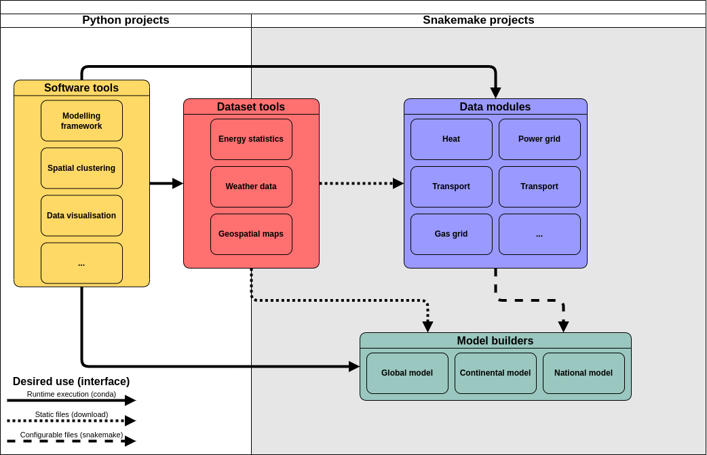

# Our Framework

We distinguish four main types of components, all of which are stand alone projects.
Ensuring modularity and containerisation implies a shared approach to the way these access one another.

Below is a general description of how our set of components achieves this, and how they interface with one another.



## Components

### Software tools

These are general-purpose libraries or tools that can be used in other projects via package managers, offering standardised solutions to commonly seen problems. Since users interact with them through code, they must focus on portability, good documentation, and exhaustive testing.

??? info "Interfacing"

    The default method of access for these is [conda-forge](https://conda-forge.org/). This allows these tools to integrate into other components in a platform independent way via [environment files](https://docs.conda.io/projects/conda/en/latest/user-guide/tasks/manage-environments.html). Additionally, [snakemake wrappers](https://snakemake.readthedocs.io/en/stable/snakefiles/modularization.html#wrappers) may be created to avoid the need to rewrite common uses of a software tool between data modules.

### Dataset tools

These tools are used to create data for reuse in a broad range of cases. The key distinguishing feature of dataset tools as opposed to other components is that they generate a single set of versioned data as output, with no user configuration.
They can vary widely on their methodological complexity, so the choice of programming language or tool used for them should be assessed in a case-by-case basis.
A higher focus is put on following [FAIR principles](https://www.go-fair.org/fair-principles/), solid metadata standards, and thorough data validation.

??? info "Interfacing"

    Users usually only ever need to interact with the resulting data and will rarely need to run these tools directly.

    The datasets produced by these tools are accessed via downloads, so the size and structure of the data should be kept in mind when choosing how to distribute them.

    - For smaller datasets (< 1 GB), non-queryable databases such as [Zenodo](https://zenodo.org/) are sufficient.
    - For larger datasets (> 1 GB), developers should consult with their respective institutions for the possibility of using chunked and queryable data access methods, such as [THREADS](https://www.unidata.ucar.edu/software/tds/), enabling efficient data access via protocols like [OPeNDAP](https://www.opendap.org/).

### Data modules

These are topic-specific data-generating [`snakemake`](https://snakemake.github.io/) workflows that can be configured to produce case-specific data, allowing users to tune certain assumptions via configuration files or by through input data. These modules follow a commonly agreed input/output structure, their methodology is well documented, and they rely on datasets and software libraries that are trustworthy and stable. This is achieved through a standardised template that all data modules must follow.

??? info "Interfacing"

    These are accessed by other workflows via [snakemake’s module functionality](https://snakemake.readthedocs.io/en/stable/snakefiles/modularization.html#modules).
    Below is an example of how a data module can be accessed by another workflow.

    ```python
    # Include local module configuration.
    configfile: "config/modules/foobar.yaml"

    module foobar:
        # Request a specific module version.
        snakefile:
            github(
                "calliope-project/foobar",
                path="workflow/Snakefile",
                tag="v1.0.0"
            )
        # Module configuration has its own key to ensure isolation.
        config: config["foobar"]
        # A prefix is added to isolate module input/output files.
        prefix: "results/module_foobar"

    # Rewrite rule names to avoid naming conflicts
    use rule * from foobar as module_foobar_*
    ```

??? note "Template"

    All data modules should follow [our standardised template](https://github.com/calliope-project/data-module-template).
    This template provides a baseline for developers to ensure the following.

    - Version-specific access via version tags.
    - Isolated configuration between modules.
    - Standardised documentation for module interfacing.

### Model builders

These are study-specific workflows that combine the outputs of all other types of components to produce an energy systems model aiming to answer a particular research question. They are highly heterogeneous in their components and are tailored to generating a model for a specific modelling framework.

??? info "Interfacing"

    Model builders may access all other components above as needed.
    Since they tend to be study-specific, they will rarely (if ever) be accessed by other tools or components.
    It is perfectly possible to ensure that a model builder can be accessed modularly, but this is not required.

## The `clio_tools` integration utilities

To save time and enable component developers to check against the latest `clio` standards, we provide the `clio_tools` library.
This is a set of useful utility functions, geared towards ensuring smooth interfacing.

For more information, check the [`clio_tools` API](../clio_tools_API/index.md)
